# Urban Mobility Pipeline

Built a complete end-to-end data platform to ingest, process, and analyze complex, multi-source public datasets for business intelligence.

---

## Table of Contents

1. [Introduction](#introduction)
2. [Objectives](#objectives)
3. [System Architecture](#system-architecture)
   - [Directory Structure](#directory-structure)
   - [Pipeline Overview](#pipeline-overview)
   - [Data Lake Architecture](#data-lake-architecture)
   - [Database Schema](#database-schema)
   - [Data Model](#data-model)
   - [Data Lineage](#data-lineage)
4. [Setup and Installation](#setup-and-installation)
   - [Prerequisites](#prerequisites)
   - [Environment Configuration](#environment-configuration)
   - [User Interfaces](#user-interfaces)
5. [Considerations & Limitations](#considerations--limitations)
6. [Future Enhancements](#future-enhancements)

---

## Introduction

Urban mobility is a critical concern for modern cities, requiring robust data solutions to enable informed decisions for transportation, infrastructure, and sustainability. This project delivers a scalable, modular data pipeline that ingests, processes, and analyzes diverse urban mobility datasets, empowering business intelligence and analytics teams to derive actionable insights.

## Objectives

- Aggregate and harmonize complex, multi-source public urban mobility datasets.
- Build a robust ELT (Extract, Load, Transform) pipeline for efficient data processing.
- Enable flexible analytics and visualization to support decision-making.
- Provide a foundation for advanced data science, reporting, and business intelligence use cases.

## System Architecture

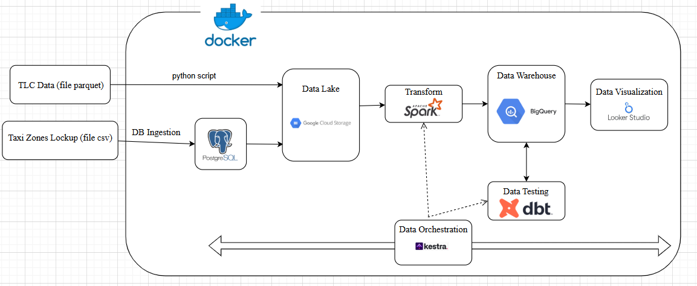

### Directory Structure

The repository is organized for clarity and modularity. Key components include:

```
├── 01-docker-terraform/
│   ├── 1_terraform_gcp/        # IaC scripts for GCP (main.tf, variables.tf)
│   └── 2_docker_sql/           # Docker setup for SQL ingest (Dockerfile, ingest_data.py)
├── 02-workflow-orchestration/  # Workflow orchestration (e.g., Kestra flows)
├── 03-data-warehouse/          # BigQuery schemas, warehouse logic
├── 04-analytics-engineering/
│   └── taxi_rides_ny/          # dbt project for analytics engineering
├── docs/                       # Documentation
├── .github/                    # GitHub workflows, issue templates
├── .vscode/                    # Editor config
└── README.md                   # Main project documentation
```

### Pipeline Overview

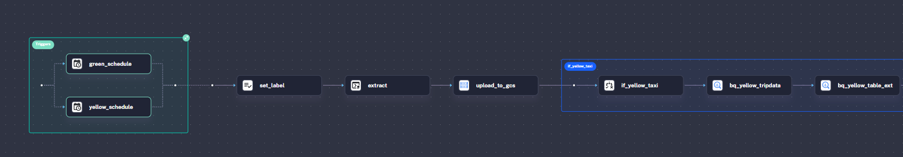
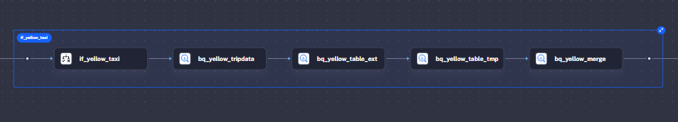
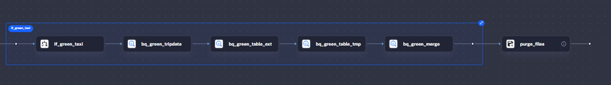
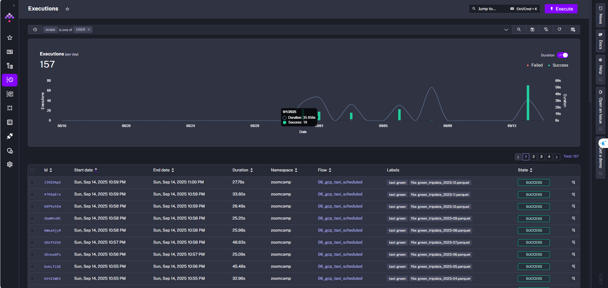

The pipeline leverages Docker for containerization and Kestra for orchestration, following best practices for modern data engineering:

1. **Data Ingestion**: Collects urban mobility data from public sources and APIs, loading it into MySQL for initial processing.
2. **Raw to Datalake**: Employs Spark and Polars for transformation, storing optimized Parquet files in Google Cloud Storage(object storage).
3. **Data Warehouse**: Loads cleansed, enriched data into Google BigQuery for advanced analytics and reporting.
4. **Transformations**: Utilizes dbt for declarative transformations and modeling.
5. **Visualization**: Powers business dashboards with Google Data Studio.

### Data Lake Architecture


The Data Lake is structured to support scalability and performance:
- **Raw Zone**: Ingested data in its original format (CSV, JSON, XML).
- **Processed Zone**: Cleaned and transformed data in Parquet format.

### Data Warehouse Schema

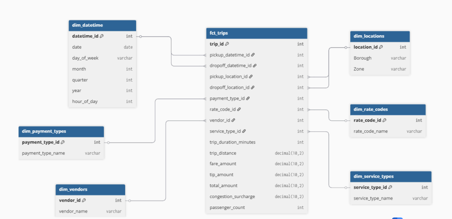

The Data Warehouse with Star Schema modeling:

- **Staging**: Raw ingested data
- **Fact & Dimensional**: Aggregated, feature-engineered, and analytics-ready data

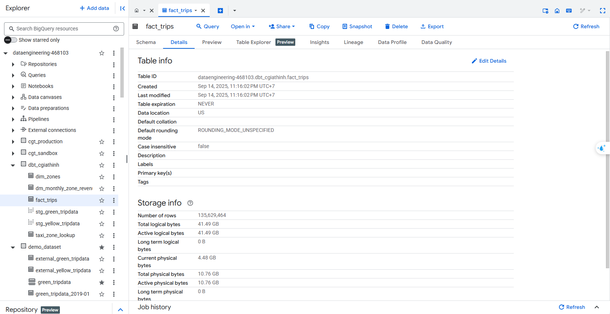

All files are stored in Parquet format for performance and scalability. Media files (e.g., images, sensor logs) follow a consistent naming scheme for seamless integration.

### Data Model

The data model is designed to support the analytical needs of urban mobility stakeholders. Key entities include:

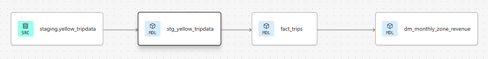
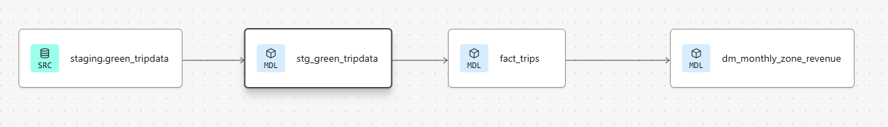
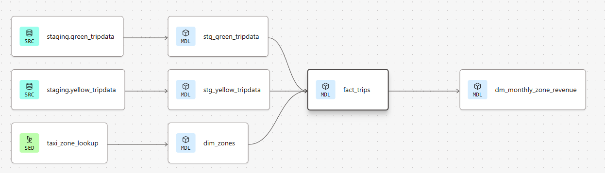

## Setup and Installation

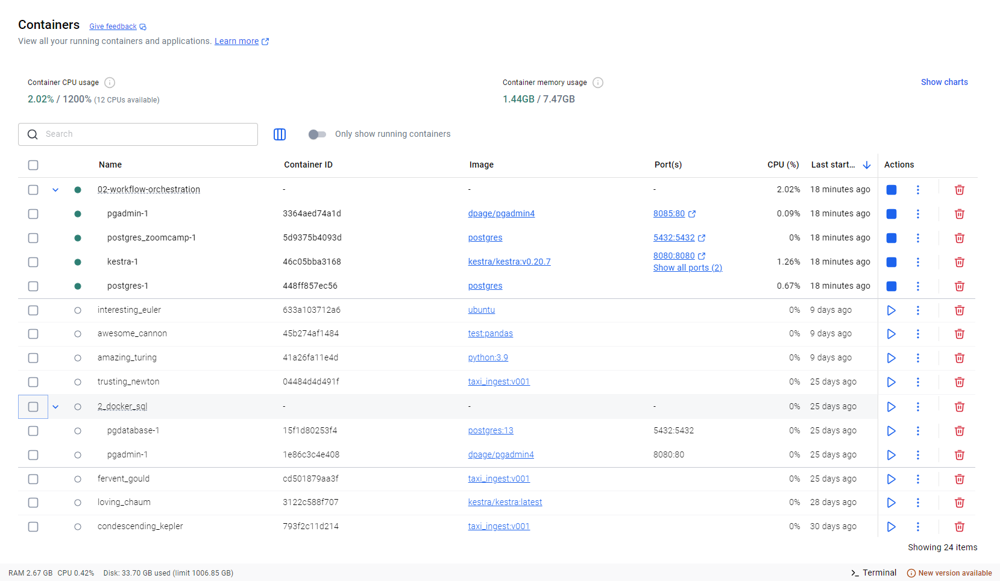

### Prerequisites

- [Git](https://git-scm.com/)
- [Docker](https://docs.docker.com/engine/install/) (>= 4GB RAM, 6 cores, 16GB disk)
- [CMake](https://cmake.org/install/) (for UNIX systems)
- Python 3.x (3.9.x recommended)
- [pipenv](https://pipenv.pypa.io/) or [virtualenv](https://virtualenv.pypa.io/)
- Open ports: 3306, 5432, 9000, 9001, 3001, 8501, 4040, 7077, 8080, 3030
- Database client (e.g., DBeaver)

### Environment Configuration

Clone the repository and configure environment variables:

```bash
git clone https://github.com/caogiathinh/Urban_Mobility_Pipeline.git
cd Urban_Mobility_Pipeline
  cp .env.example .env
# Edit .env files with your credentials (see examples below)
```

### User Interfaces

- Kestra: [http://localhost:8080](http://localhost:8080)
- Google Data Studio Dashboard: [https://lookerstudio.google.com/u/1/reporting/1a07c16e-3cef-4cbf-bac1-a8614d464323/page/yrJXF](https://lookerstudio.google.com/u/1/reporting/1a07c16e-3cef-4cbf-bac1-a8614d464323/page/yrJXF)

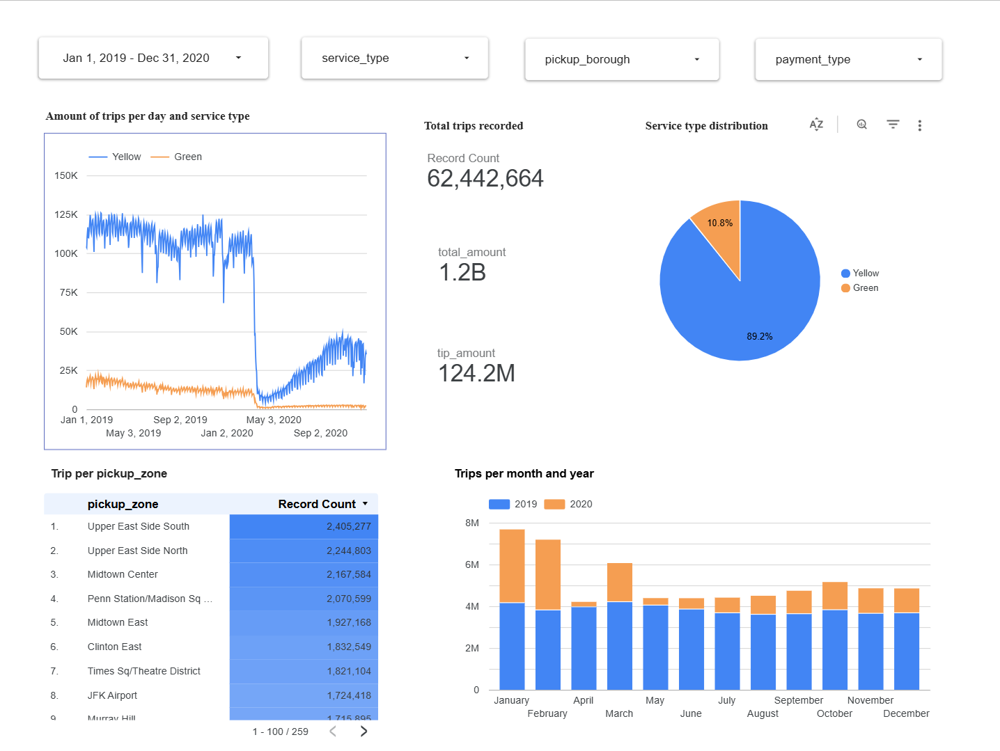

## Considerations & Limitations

- **Development Only**: Current setup is for development; production deployment requires further hardening.
- **Schema Evolution**: dbt transformations are modular; future schema changes should be versioned.


## Future Enhancements

- Complete processing big data with Apache Spark.
- Implement testing, staging, and CI/CD pipelines.
- Expand dbt transformations for richer business logic.
- Complete streaming realtime with Apache Kafka.


---

